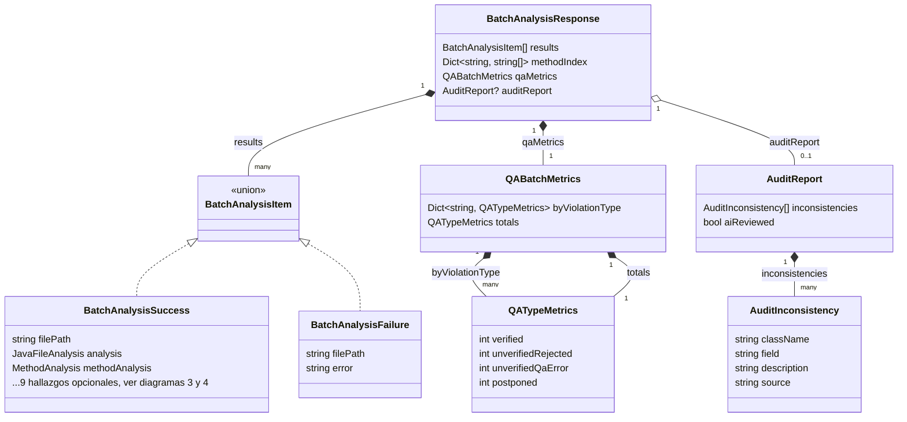
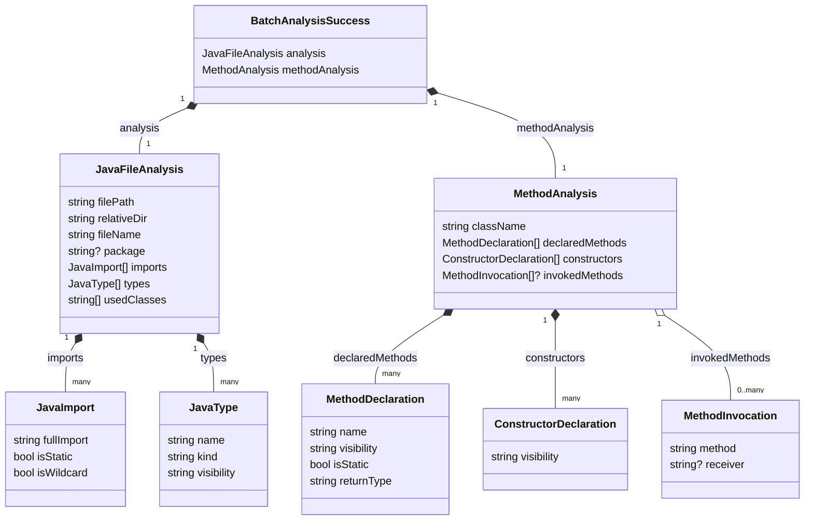
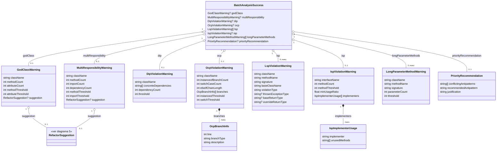
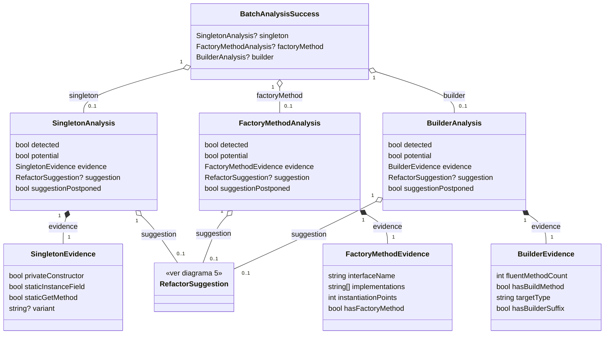
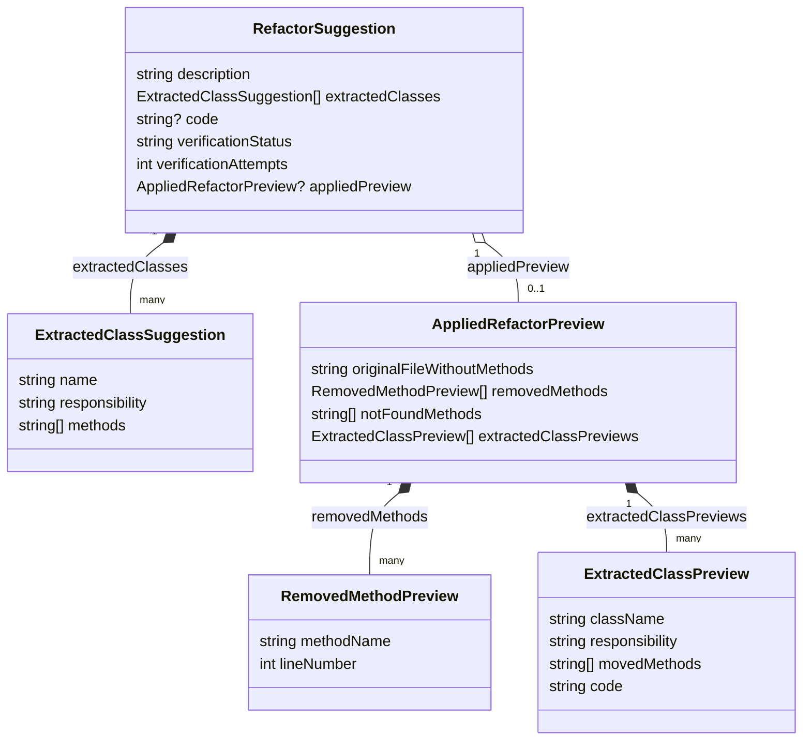

# Modelo de datos

Diagrama de clases de los schemas Pydantic que forman el contrato de
`POST /analyze/batch` (`app/schemas/analysis.py` del backend) y cómo se
mapean a las interfaces TypeScript equivalentes del lado de la extensión
(`src/models/types.ts`, `src/interfaces/IBatchAnalyzerService.ts`).

Esta página cubre solo el contrato de **analyze** — es, con diferencia, el
más grande y el que consume toda la UI de reporte. El backend tiene otros
contratos más chicos y autocontenidos (`feedback.py`, `refactor_choice.py`,
`history.py`, `ai_metrics.py`, el I/O interno del agente QA en `qa.py`) que
no están acá; su forma completa (campo por campo) vive en el
[Contrato de API](/api-contrato/) generado desde `openapi.yaml`. Esta página
es un complemento a ese contrato, no un reemplazo: se enfoca en la
**estructura y las relaciones** entre schemas, no en documentar cada campo.

Los cinco diagramas están separados por dominio (el envoltorio de la
respuesta, los datos crudos de un archivo Java, los antipatrones SOLID, los
patrones creacionales, y `RefactorSuggestion`) porque juntar las ~35 clases
en un solo diagrama las hace ilegibles — cada uno es una vista distinta del
mismo grafo de objetos.

## 1. Envoltorio de la respuesta

`BatchAnalysisResponse` es la raíz. `results` es una lista de
`BatchAnalysisItem`, que en Python es un `typing.Union[BatchAnalysisSuccess,
BatchAnalysisFailure]` — no una jerarquía de clases real con una base común;
se representa acá como una interfaz para mostrar que cada item del batch es
uno **u otro**, discriminados en runtime por la presencia del campo `error`.

`qaMetrics` y `auditReport` son metadatos del *batch completo*, no de un
archivo — por eso cuelgan de `BatchAnalysisResponse` y no de cada
`BatchAnalysisSuccess`. `auditReport` es `null` salvo que `AUDIT_ENABLED`
esté activo; `qaMetrics` viaja siempre, en ceros si `QA_VERIFICATION_ENABLED`
está apagado.

## 2. Estructura de un archivo Java analizado

Los dos campos siempre presentes de `BatchAnalysisSuccess`: `analysis`
(salida del motor tree-sitter/estructural) y `methodAnalysis` (métodos,
constructores e invocaciones).

`invokedMethods` es `null` salvo que la request lleve
`?includeInvocations=true` (setting `prueba.showInvokedMethods` del lado de
la extensión) — es la única relación opcional de este diagrama; todo lo
demás siempre viaja poblado (aunque sea con listas vacías).

## 3. Antipatrones SOLID y estructurales

Ocho de los diez tipos de antipatrón que detecta el backend. Cada uno
cuelga de `BatchAnalysisSuccess` como campo opcional (o lista vacía para los
que pueden repetirse por clase: LSP y Long Parameter List). Solo **God
Class** y **SRP** (`MultiResponsibilityWarning`) tienen `suggestion` — son
los únicos con generación de refactor por IA; los demás no (ver las páginas
de [DIP](./antipatrones/dip), [OCP](./antipatrones/ocp),
[LSP](./antipatrones/lsp) e [ISP](./antipatrones/isp)).

## 4. Patrones creacionales

Singleton, Factory Method y Builder comparten la misma forma: `detected` +
`potential` + evidencia estructural propia + `suggestion` opcional +
`suggestionPostponed` (se pospone la sugerencia si la misma clase tiene una
violación estructural sin resolver — God Class o SRP).

`variant` (`SingletonEvidence`) solo se llena cuando `detected = true`:
`"classic"` | `"enum"` | `"eager_static"`, en ese orden de prioridad si hay
más de una forma presente a la vez.

## 5. `RefactorSuggestion` y su vista previa aplicada

La misma `RefactorSuggestion` se reutiliza desde cinco hallazgos distintos
(God Class, SRP, Singleton, Factory Method, Builder) — por eso se separa en
su propio diagrama en vez de repetirla cuatro veces más arriba.

`verificationStatus`/`verificationAttempts` son el resultado del pipeline
QA-Refactor; default `"unverified"`/`1` si el pipeline no corrió.
`appliedPreview` es `null` para sugerencias creacionales (`extractedClasses`
vacío — Singleton/Factory/Builder no mueven métodos) o si el cálculo con
tree-sitter falló. Un cuarto campo, `verificationOutcome`, existe en Python
pero tiene `exclude=True`: se usa solo para las métricas internas del QA y
**nunca** se serializa — no tiene equivalente del lado TS porque nunca
viaja por la red.

## Del schema Python a la interfaz TS

La extensión no deserializa la respuesta 1:1: `BackendAnalyzerService.ts`
recibe el JSON con la forma exacta de `BatchAnalysisSuccess`
(`BackendFileResult`, su tipo interno) y lo **aplana** hacia `FileAnalysis`
— mueve los ocho hallazgos que en Python son campos *hermanos* de
`methodAnalysis` a que queden *dentro* de `methodAnalysis`, y le agrega
`filePath` a mano porque el `MethodAnalysis` de Python no lo trae.

### `BatchAnalysisSuccess` → `BatchFileResult` + `FileAnalysis`

| Campo en Python (`BatchAnalysisSuccess`) | Dónde termina en TS | Nota |
|---|---|---|
| `filePath` | `BatchFileResult.filePath` **y** `FileAnalysis.filePath` | se copia en los dos lugares; `MethodAnalysis` (Python) no tiene `filePath` propio, se lo inyecta el mapeo |
| `analysis` | `BatchFileResult.analysis` | 1:1, mismo shape `JavaFileAnalysis` |
| `methodAnalysis.{className,declaredMethods,constructors,invokedMethods}` | `FileAnalysis.{...}` | se copian tal cual con spread (`...r.methodAnalysis`) |
| `godClass`, `multiResponsibility`, `singleton`, `factoryMethod`, `builder`, `dip`, `ocp`, `isp`, `priorityRecommendation` | `FileAnalysis.{mismo nombre}` | pasan de hermanos de `methodAnalysis` a campos internos de `FileAnalysis`; solo se agregan si vienen truthy (`null` → el campo queda **ausente**, no `null`, en TS) |
| `lsp`, `longParameterMethods` | `FileAnalysis.{mismo nombre}` | mismo aplanamiento, pero con `?? []` — quedan como lista vacía en vez de ausentes |

`BatchFileResult` (interfaz pública, `src/interfaces/IBatchAnalyzerService.ts`)
es el tipo que ve el resto de la extensión; `BackendFileResult` (en
`BackendAnalyzerService.ts`) es un tipo **privado** que solo describe el JSON
crudo tal como lo manda el backend, previo al aplanado.

### `RefactorSuggestion` → `RefactorSuggestion`

A diferencia del anterior, este mapeo es prácticamente 1:1 — la extensión
reenvía el objeto tal cual lo recibe, sin transformarlo:

| Campo Python | Campo TS | Nota |
|---|---|---|
| `description: str` | `description: string` | igual |
| `extractedClasses: list[...]` | `extractedClasses: ExtractedClassSuggestion[]` | igual |
| `code: str \| None` | `code?: string \| null` | igual |
| `verificationStatus: Literal[...]` | `verificationStatus?: 'verified' \| 'unverified'` | opcional del lado TS por compatibilidad con backends anteriores al pipeline QA |
| `verificationAttempts: int` | `verificationAttempts?: number` | ídem |
| `appliedPreview: AppliedRefactorPreview \| None` | `appliedPreview?: AppliedRefactorPreview \| null` | ídem |
| `verificationOutcome` (`exclude=True`) | *no existe* | nunca se serializa; ver diagrama 5 |

### `GodClassWarning` → `GodClassWarning` (mapeo directo, sin transformación)

Para contraste con el aplanamiento de `BatchAnalysisSuccess`: la mayoría de
los hallazgos individuales sí son 1:1, campo por campo, sin ningún cambio
de forma:

| Campo Python | Campo TS |
|---|---|
| `className: str` | `className: string` |
| `methodCount: int` | `methodCount: number` |
| `attributeCount: int` | `attributeCount: number` |
| `methodThreshold: int` | `methodThreshold: number` |
| `attributeThreshold: int` | `attributeThreshold: number` |
| `suggestion: RefactorSuggestion \| None` | `suggestion?: RefactorSuggestion \| null` |
